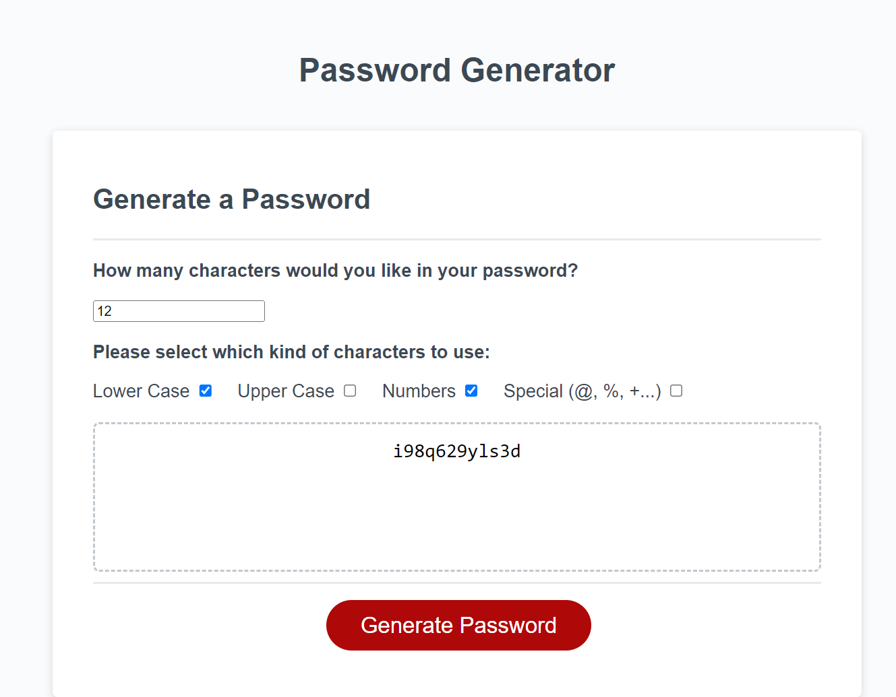
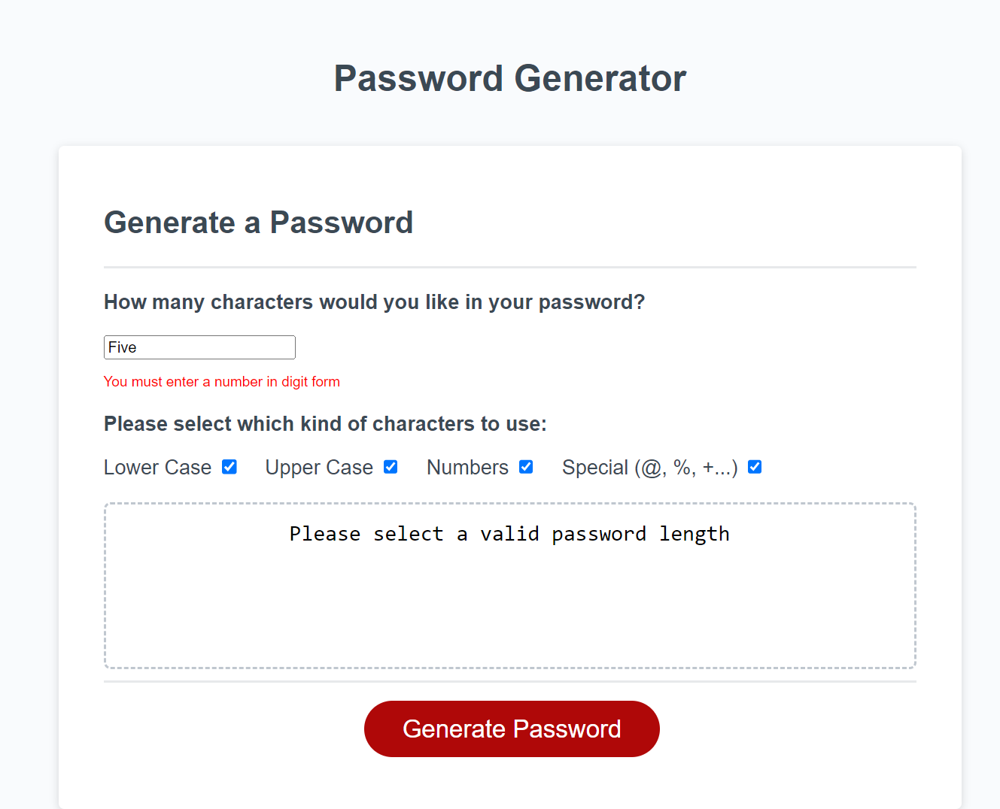

# Password-Generator

## Link to site

https://daisyeverard.github.io/Password-Generator/

## Preview

  
  

## Description

A simple tool to generate a random password that meets various criteria.
The user can choose how many characters to include and what kinds of characters (uppercase, lowercase, numerical, special). 

- If the length is less than 10, or more than 64, an error message displays
- If no character types are selected, an error displays
- If number not entered, error displays
- Each selected character type will appear at least once in the password. 
- The password is displayed in a text box once generated. 

## Issues and solutions

#### linking input boxes to Javascript functions: 
document.getElementById('id-name') will find the id in html. You can then use various prefixes such as .value, .checked, .text content to get a value returned, or change it in the html. 

#### Making every character type appear at least once
The optionsArray containing all characters selected was changed by using push to make it a set of sub arrays, each with one type of characters. This then allows you to count how many types were selected (how many sub arrays), create a password missing this many characters, and create a loop to select a random item from each of these subarrays and add it to the password. 

### still displaying added characters if no length added

## License

MIT License
